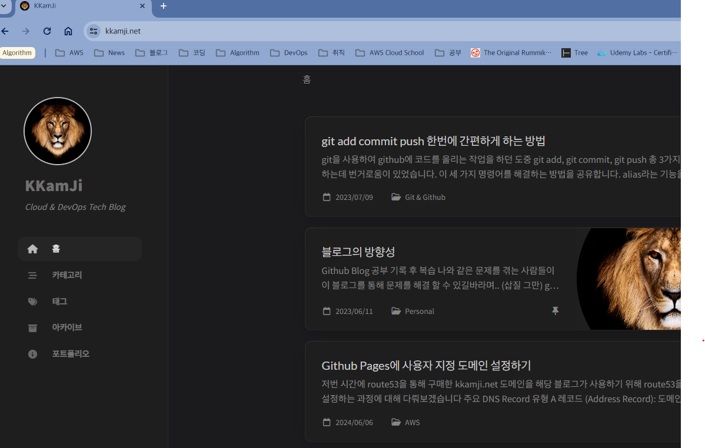

저번 시간에 route53을 통해 구매한 kkamji.net 도메인을 해당 블로그가 사용하기 위해 route53을 사용해서 DNS Record 설정하는 과정에 대해 다뤄보겠습니다.  
해당 과정을 거치면 www.kkamji.net, kkamji.net 두 개의 방법으로 블로그에 접근이 가능합니다.

## 주요 DNS Record 유형

A 레코드 (Address Record): 도메인 이름을 IPv4 주소로 매핑
AAAA 레코드: 도메인 이름을 IPv6 주소로 매핑
CNAME 레코드 (Canonical Name Record): 도메인 이름을 다른 도메인 이름으로 매핑
MX 레코드 (Mail Exchange Record): 도메인 이름을 이메일 서버로 매핑
TXT 레코드 (Text Record): 도메인에 대한 텍스트 정보를 저장
NS 레코드 (Name Server Record): 도메인의 네임 서버를 지정
PTR 레코드 (Pointer Record): IP 주소를 도메인 이름으로 매핑
SRV 레코드 (Service Record): 특정 서비스에 대한 서버의 위치를 지정
SOA 레코드 (Start of Authority Record): DNS 영역에 대한 권한 있는 정보와 기본 설정을 제공
ALIAS 레코드: 루트 도메인(@)을 다른 도메인으로 매핑

## A 레코드 설정

1. A 레코드를 생성하기 위해 Route53 > Hosted zones > 설정할 도메인에 들어가준 뒤 Create record를 클릭합니다
    
2. Record type에서 A 속성을 선택한 뒤, Github Pages의 IP 주소를 입력합니다. Routing policy는 가중치 기반 라우팅, 거리 기반 라우팅 등의 설정이 있지만 단순 라우팅으로 설정했습니다.
    
    ``` text
    185.199.108.153
    185.199.109.153
    185.199.110.153
    185.199.111.153
    ```

## CNAME 설정

1. A 레코드를 생성할 때와 동일하게 Create record를 클릭하여 설정 화면에 들어가줍니다.
2. Record type에서 CNAME 속성을 선택한 뒤, Record name에 sub domain인 www를 적어준 뒤, Value에 kkamji.net을 적어 매핑시켜줍니다.
    

## Github Pages 설정

1. Repository 최상위 디렉토리에 CNAME 파일을 생성한뒤 파일의 내용에 **kkamji.net**을 추가해줍니다.
2. 이후 Repository > Settings > Pages에 들어간 뒤, Custom Domain에 **kkamji.net**을 추가해준 뒤, Save를 눌러줍니다.
   > 클릭을 하면 DNS Check 이후 이제 홈페이지가 kkamji.net으로 호스팅되게 됩니다.
   {: .prompt-info}
    


## 확인


> **궁금하신점이나 추가해야할 부분은 댓글이나 아래의 링크를 통해 문의해주세요.**  
> **Written with [KKam.\_\.Ji](https://www.instagram.com/kkam._.ji/)**
{: .prompt-info}
